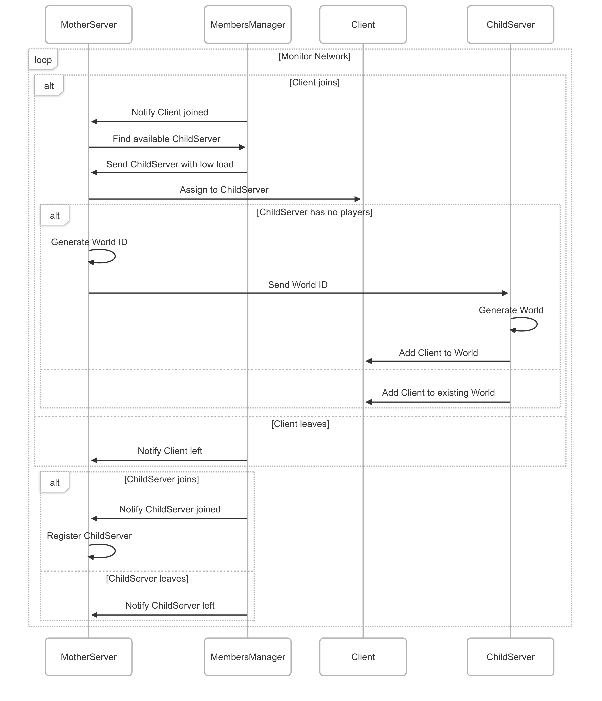

# Raga.io

- [Elvis Perlika](mailto:elvis.perlika@studio.unibo.it)
- [Eleonora Falconi](mailto:eleonora.falconi2@studio.unibo.it)

## Table of Contents

<!-- add below the toc -->
- [Raga.io](#ragaio)
  - [Table of Contents](#table-of-contents)
  - [AI Disclaimer](#ai-disclaimer)
  - [Abstract](#abstract)
  - [Concept](#concept)
  - [Requirements](#requirements)
    - [Functional Requirements](#functional-requirements)
  - [Design](#design)
    - [Architecture](#architecture)
    - [Infrastructure](#infrastructure)
      - [Deployment](#deployment)
      - [Components](#components)
    - [Modelling](#modelling)
      - [Client](#client)
        - [Client Model](#client-model)
        - [Client Controller](#client-controller)
        - [Client View](#client-view)
      - [Mother Server](#mother-server)
      - [Child Server](#child-server)
      - [Protocol](#protocol)
      - [Full Diagram](#full-diagram)
    - [Interaction](#interaction)
      - [Client - Mother Server - Child Server connection and gameplay flow](#client---mother-server---child-server-connection-and-gameplay-flow)
      - [Mother Server - Child Server flow](#mother-server---child-server-flow)
    - [Behaviour](#behaviour)
    - [Data and Consistency Issues](#data-and-consistency-issues)
    - [Fault-Tolerance](#fault-tolerance)
    - [Availability](#availability)
    - [Security](#security)
  - [Implementation](#implementation)
    - [Technological details](#technological-details)
  - [Validation](#validation)
    - [Acceptance test](#acceptance-test)
  - [Release](#release)
  - [Deployment](#deployment-1)
  - [User Guide](#user-guide)
    - [Menu view](#menu-view)
    - [Game view](#game-view)
  - [Self-evaluation](#self-evaluation)

## AI Disclaimer

During the preparation of this work, the authors used Chat-GPT and Gemini to
refine the report by improving sentence structure and correcting grammatical errors.
After using these tools, the authors reviewed and edited the
content as needed and takes full responsibility for the content of the
final report/artifact.

## Abstract

<!-- Brief description of the project, its goals, and its achievements. -->

Agar.io is an online, massively multiplayer action game. Players take on the role of a small, circular cell inside a map that resembles a [Petri dish](https://arc.net/l/quote/ihqtspfk). The primary goal is to grow as large as possible by consuming smaller cells, both those controlled by other players and those that are scattered randomly throughout the game world as food. This simple premise leads to a dynamic and competitive environment where a player's size directly dictates their power and vulnerability. Players can join a randomly assigned game session, create a new session, or join an existing one using a unique session ID. The session ends only when the player is eaten or decides to quit.

The goal of this project is to design and develop a clone of Agar.io with a robust client–server architecture, ensuring scalability, performance, and smooth multiplayer interaction.

Achievements:

- Developed a real-time client–server architecture supporting multiple concurrent players.
- Implemented smooth synchronization and communication protocols to minimize lag.
- Designed an efficient game loop for rendering, collision detection, and player interaction.
- Created scalable server logic capable of handling large numbers of simultaneous connections.
- Implemented core game mechanics: cell growth, collision handling, food spawning, and player elimination.
- Delivered a competitive multiplayer experience close to the original Agar.io.

## Concept

<!-- Here you should explain:

- The type of product developed with that project, for example (non-exhaustive):
  - Application (with GUI, be it mobile, web, or desktop)
  - Command-line application (CLI could be used by humans or scripts)
  - Library
  - Web-service(s) -->

This project is a desktop application with a graphical user interface (GUI) packaged as a Java Archive (JAR) file. It can be executed on any system with a Java Runtime Environment (JRE) installed.

<!-- - Use case collection
  - _where_ are the users?
  - _when_ and _how frequently_ do they interact with the system?
  - _how_ do they _interact_ with the system? which _devices_ are they using?
  - does the system need to _store_ user's __data__? _which_? _where_?
  - most likely, there will be _multiple_ __roles__ -->

- **Primary Users**: The game is designed for casual gamers who enjoy competitive multiplayer experiences. Players can be located anywhere worldwide, as it is built for online play.
- **Usage Patterns**: Sessions are typically short and played during leisure time, ranging from just a few minutes up to an hour.
- **Interaction Method**: Players interact through a **graphical user interface (GUI)** on desktop computers, using a mouse to control their in-game cell.
- **Data Handling**: No personal data is stored. The system only maintains temporary session data (e.g., player positions, scores), which is discarded once the session ends.
- **User Roles**: There is only one role: **Player**. All users share the same capabilities, with no role-based differences or special permissions.

## Requirements

<!-- - The requirements must explain __what__ (not how) the software being produced should do.
  - you should not focus on the particular problems, but exclusively on what you want the application to do.

- Requirements must be clearly identified, and possibly numbered

- Requirements are divided into:
  - __Functional__: some functionality the software should provide to the user
  - __Non-functional__: requirements that do not directly concern behavioural aspects, such as consistency, availability, etc.
  - __Implementation__: constrain the entire phase of system realization, for instance by requiring the use of a specific programming language and/or a specific software tool
    - these constraints should be adequately justified by political / economic / administrative reasons...
    - ... otherwise, implementation choices should emerge _as a consequence of_ design

- If there are domain-specific terms, these should be explained in a glossary

- Each requirement must have its own __acceptance criteria__
  - these will be important for the validation phase -->

### Functional Requirements

1. Ability to join a random game session.
2. Ability to create a new game session.
3. Ability to join an existing session using a unique session ID.
4. Support for multiple concurrent players in a session.
    - *Acceptance criteria:* at least 5 concurrent players per session.
5. Real-time visibility and interaction between players.
    - *Acceptance criteria:* latency < 200ms.
6. Low-latency handling of movements and actions.
    - *Acceptance criteria:* maintain a frame rate of at least 30 FPS during typical gameplay.
7. Mechanism for consuming smaller cells (players or food) to increase size.
    - *Acceptance criteria:* players can consume smaller cells and visibly grow in size.
8. Random spawning of food items within the map.
9. Collision detection and outcome resolution based on cell size.
10. Sessions conclude when a player is eliminated or chooses to exit.
11. Intuitive GUI for session management.
    - Button to join a random session.
    - Nickname input field.
    - Button to create a new session and join it.
    - Input field for entering a session ID to join an existing session.
    - Button to join the specified session.
12. Visual representation of player cells, food items, and other players.
    - Display player names.
    - Display the session ID so players can share it with friends.
13. Scalable server architecture to handle increasing player numbers.
14. A master server coordinating multiple game servers that manage individual game sessions.
15. Dynamic allocation of players to game servers based on load and availability.
16. The server architecture should support scaling to accommodate increasing numbers of concurrent sessions and players.
17. Backup and failover mechanisms to ensure session continuity in case of game server failure.

## Design

<!-- This chapter explains the strategies used to meet the requirements identified in the analysis.
Ideally, the design should be the same, regardless of the technological choices made during the implementation phase.

> You can re-order the sections as you prefer, but all the sections must be present in the end -->

### Architecture

<!-- - Which architectural style?
  - why? -->

This project employs a **client-server architecture** with a distributed system design. The architecture consists of three main components: the Client, the Mother Server, and multiple Child Servers.

### Infrastructure

<!-- - are there _infrastructural components_ that need to be introduced? _how many_?
  - e.g. _clients_, _servers_, _load balancers_, _caches_, _databases_, _message brokers_, _queues_, _workers_, _proxies_, _firewalls_, _CDNs_, _etc._

- how do components _distribute_ over the network? _where_?
  - e.g. do servers / brokers / databases / etc. sit on the same machine? on the same network? on the same datacenter? on the same continent?

- how do components _find_ each other?
  - how to _name_ components?
  - e.g. DNS, _service discovery_, _load balancing_, _etc._

> Component diagrams are welcome here -->

#### Deployment

The system architecture consists of three main components:


- **Client**: The client application is a desktop GUI that players use to interact with the game. It handles user input, renders the game state, and communicates with the servers.
- **Mother Server**: The Mother Server acts as a central coordinator. It manages game sessions, handles player matchmaking, and distributes players to Child Servers based on load and availability.
- **Child Servers**: Each Child Server manages one game session. It handles real-time game logic, player interactions, and communicates with the Mother Server for session management.

#### Components


Client service:

- **LoginService**: manages user connection with the Mother Server.
- **GamePlayService**: handles gameplay activities and user interactions and communicates with the Child Server for real-time updates.

Mother Server service:

- **MembersManager**: discovers Clients and Child Servers that access the system and manages pending Clients when no Child Server is available.
- **BackupService**: handles backup data from Child Servers.
- **BalanceService**: distributes clients to Child Servers based on load.

Child Server service:

- **BackupService**: manages local backups and forwards them to the Mother Server.
- **ClientsManager**: receives and manages clients assigned from the Mother Server.
- **SyncService**: synchronizes the game world state between local and remote instances.

This architecture allows for scalability, as multiple Child Servers can be added to handle more game sessions as needed. The Mother Server is the seed node of the system and must always be started first. Child Servers can be started and stopped dynamically, allowing for flexible resource management.
Child Servers can be hosted on different machines or cloud instances to distribute the load effectively, it's not mandatory to have them on the same network or datacenter as the Mother Server.

### Modelling

<!-- - which __domain entities__ are there?
  - e.g. _users_, _products_, _orders_, _etc._

- how do _domain entities_ __map to__ _infrastructural components_?
  - e.g. state of a video game on central server, while inputs/representations on clients
  - e.g. where to store messages in an IM app? for how long?

- which __domain events__ are there?
  - e.g. _user registered_, _product added to cart_, _order placed_, _etc._

- which sorts of __messages__ are exchanged?
  - e.g. _commands_, _events_, _queries_, _etc._

- what information does the __state__ of the system comprehend
  - e.g. _users' data_, _products' data_, _orders' data_, _etc._ -->

<!-- > Class diagram are welcome here -->

#### Client

The client, which has a graphical user interface (GUI), is structured according to the **Model-View-Controller (MVC)** architectural pattern, which separates the application into three interconnected components: the Model, the View, and the Controller.


##### Client Model

The Model encapsulates the game logic and state management:

- Entity (interface): A common abstraction implemented by LocalPlayer and LocalFood.
- LocalPlayer and LocalFood: Entities within the game world.
- LocalWorld: Represents the game environment, containing multiple players and food objects (composition relation).
- GameStateManager and ImmutableGameStateManager: Handle the game state. The immutable version provides read-only access to the state.
- EatingManager: Handles interactions related to eating mechanics between entities.
- AIMovements: Updates the behavior and movement of AI players, if present.

##### Client Controller

The Controller handles interactions and updates between the model and the view:

- ClientActor: Central controller component managing the game flow and communication with servers.
- WorldConverter: Used by ClientActor to transform model data into a format suitable for the local computation.

##### Client View

The View presents the game to the user:

- View (interface): General abstraction for different visual components.
- MenuView, EndGameView, LocalView: Different visual representations of the game’s state (menu, in-game, end screen).
- AgarViewUtils: Utility functions used by LocalView to draw game elements.

#### Mother Server


The Mother Server coordinates the main management logic:

- MotherActor: The central actor of the system.
- MembersManager: Discover Clients and Child Servers that access the system.
- BackupService: Manage data backup operations.
- MotherState: Store the Child Servers and pending Clients references.
- ChildState: Represent the state of a Child Server, including its load and the world's ID managed.

#### Child Server


Child Servers manage individual game sessions and receive players from the Mother Server.

#### Protocol

As seen in the class diagrams above, there are a set of classes shared between the Mother Server and Child Server components. These classes are used to represent the world state of a game session and they are the body of the messages exchanged to synchronize the game state between the servers and the clients and also between the Mother Server and Child Servers. They include:

- Entity (interface): A common abstraction implemented by Player and Food.
- Player: Represents a player in the game, including attributes like ID, nickname, position and size.
- Food: Represents a food item in the game, including attributes like ID, position and size.
- World: Represents the game world, containing multiple players and food objects.

#### Full Diagram


### Interaction

<!-- - how do components _communicate_? _when_? _what_?
- _which_ __interaction patterns__ do they enact?

> Sequence diagrams are welcome here -->

#### Client - Mother Server - Child Server connection and gameplay flow


- When the Client is launched, it tries to connect to the Mother Server.
- If the Mother Server is not found → the Client remains in *Offline* state.
- If the Mother Server is found:
  - If a Child Server is available:
    - The Mother Server provides the Client with a reference to the Child Server.
    - The Client requests to join the game through the Child Server.
    - The Child Server grants access, and the Client state becomes *Connected*.
  - If no Child Server is available:
    - The Mother Server informs the Client that no Child is available.
    - The Client remains in the *Connecting…* state.
- Once a Child Server is assigned, the Client officially joins the game.
- During gameplay, for every user input:
  - The Client sends the input to the Child Server requesting a world update.
  - The Child Server processes the request and sends back the updated world to the Client.

#### Mother Server - Child Server flow



### Behaviour

<!-- - how does _each_ component __behave__ individually (e.g. in _response_ to _events_ or messages)?
  - some components may be _stateful_, others _stateless_

- which components are in charge of updating the __state__ of the system? _when_? _how_?

> State diagrams are welcome here -->

### Data and Consistency Issues

<!-- - Is there any data that needs to be stored?
  - _what_ data? _where_? _why_?

- how should _persistent data_ be __stored__?
  - e.g. relations, documents, key-value, graph, etc.
  - why?

- Which components perform queries on the database?
  - _when_? _which_ queries? _why_?
  - concurrent read? concurrent write? why?

- Is there any data that needs to be shared between components?
  - _why_? _what_ data? -->

### Fault-Tolerance

<!-- - Is there any form of data __replication__ / federation / sharing?
  - _why_? _how_ does it work?

- Is there any __heart-beating__, __timeout__, __retry mechanism__?
  - _why_? _among_ which components? _how_ does it work?

- Is there any form of __error handling__?
  - _what_ happens when a component fails? _why_? _how_? -->

### Availability

<!-- - Is there any __caching__ mechanism?
  - _where_? _why_?

- Is there any form of __load balancing__?
  - _where_? _why_?

- In case of __network partitioning__, how does the system behave?
  - _why_? _how_? -->

The software is designed to be highly available, with a distributed architecture that allows multiple game servers to handle sessions concurrently.

The Mother Server acts as a central coordinator, managing the distribution of players to various Child Servers to avoid overloading any single server. This load balancing enhances availability by ensuring that if one server becomes overwhelmed, new players can be directed to less busy servers.

If one game server fails, players can be redirected to another server without losing their session (it's mandatory to have a Child Server that is managing a game session).

### Security

<!-- - Is there any form of __authentication__?
  - _where_? _why_?

- Is there any form of __authorization__?
  - which sort of _access control_?
  - which sorts of users / _roles_? which _access rights_?

- Are __cryptographic schemas__ being used?
  - e.g. token verification,
  - e.g. data encryption, etc. -->

---
<!-- Riparti da qui  -->

There are not any kind of security mechanisms implemented, as the game is designed for casual play without sensitive data involved. Users are not required to create accounts or provide personal information, they can simply enter a nickname to join a game session. The system does not store any personal data, and all session data is temporary and discarded once the session ends.

## Implementation

<!-- - which __network protocols__ to use?
  - e.g. UDP, TCP, HTTP, WebSockets, gRPC, XMPP, AMQP, MQTT, etc.
- how should _in-transit data_ be __represented__?
  - e.g. JSON, XML, YAML, Protocol Buffers, etc.
- how should _databases_ be __queried__?
  - e.g. SQL, NoSQL, etc.
- how should components be _authenticated_?
  - e.g. OAuth, JWT, etc.
- how should components be _authorized_?
  - e.g. RBAC, ABAC, etc. -->

We choose to use **TCP (Transmission Control Protocol)** for several key reasons, with reliability and order being the most critical. Unlike UDP, TCP is a "connection-oriented" protocol that ensures data packets are delivered, and if a packet is lost, it's automatically resent. This is crucial for maintaining a consistent game state, especially for core mechanics like player movements, collisions, and cell consumption, where a lost packet could lead to players appearing to be in different locations or a desynchronized game world. Furthermore, TCP guarantees that packets arrive in the correct order, which is essential for deterministic game logic. UDP is favored for fast-paced shooters where low latency is paramount, the nature of an Agar.io clone tolerates slightly higher latency in exchange for the absolute reliability and synchronization that TCP provides.

Below is a snippet from the `application.conf` file showing the configuration for using TCP as the transport protocol with Akka's remote artery:

```yaml
  remote {
    artery {
      transport = tcp
    }
  }
```

To represent in-transit data, we opted for **JSON (JavaScript Object Notation)** produced by Akka's Jackson serializer. The converse from entity to JSON and vice versa is handled automatically by Akka, which simplifies the serialization process.

```yaml
  serializers {
    jackson-json = "akka.serialization.jackson.JacksonJsonSerializer"
  }
  serialization-bindings {
    "akka.actor.typed.ActorRef" = jackson-json
    "akka.actor.typed.internal.adapter.ActorRefAdapter" = jackson-json
    "it.unibo.protocol.Message" = jackson-json
  }
```

All data is not stored persistently, as the game is designed for temporary sessions.

### Technological details

<!-- - any particular _framework_ / _technology_ being exploited goes here -->

- Scala: main programming language used for both client and server components.
- Akka: utilized for building the actor-based concurrency model, facilitating communication between different components.
  - Akka Actors: used to implement the actor model for concurrent processing.
  - Akka Cluster: employed to create a distributed system where multiple nodes can work together.
- Java Swing: used for creating the graphical user interface (GUI) of the client application.

## Validation

<!-- ### Automatic Testing -->

<!-- - how were individual components **_unit_-test**ed?
- how was communication, interaction, and/or integration among components tested?
- how to ___end-to-end_-test__ the system?
  - e.g. production vs. test environment

- for each test specify:
  - rationale of individual tests
  - how were the test automated
  - how to run them
  - which requirement they are testing, if any

> recall that _deployment_ __automation__ is commonly used to _test_ the system in _production-like_ environment
---
> recall to test corner cases (crashes, errors, etc.) -->

### Acceptance test

<!-- - did you perform any _manual_ testing?
  - what did you test?
  - why wasn't it automatic? -->

Automatic tests were not implemented due to time constraints and the complexity of simulating real-time multiplayer interactions. However, manual testing was conducted extensively to ensure the system met the functional requirements.

Manual testing focused on the following areas:

1. **Session Management**: Verified the ability to create, join, and manage game sessions.
2. **Real-time Interaction**: Ensured that player movements and size increases, food consumption, and collisions were accurately reflected across all clients.
3. **GUI Functionality**: Tested all GUI elements for usability and responsiveness.
4. **Scalability**: Simulated multiple players joining a session to observe performance and responsiveness.
5. **Error Handling**: Tested the system's response to network interruptions and server failures.

## Release

<!-- - how where components organized into _inter-dependant modules_ or just a single monolith?
  - provide a _dependency graph_ if possible

- were modules distributed as a _single archive_ or _multiple ones_?
  - why?

- how were archive versioned?

- were archive _released_ onto some archive repository (e.g. Maven, PyPI, npm, etc.)?
  - how to _install_ them? -->

Each release is packaged into three separate JAR files: one for the **Mother Server**, one for the **Child Server**, and one for the **Client**.
This modular structure enables independent deployment and scaling of each component according to demand.

All JAR files follow **semantic versioning** (e.g., `1.0.0`, `1.1.0`, `2.0.0`), making it easier to track changes and maintain compatibility across components.

The JARs are distributed through a public GitHub repository, where users can download the latest versions. Each release is also tagged in the repository for convenient access.

Since the executables run on any system with a **Java Runtime Environment (JRE)**, they are fully platform-independent. Currently, they are executed locally, but with proper configuration they can also be deployed on remote servers.

The installation process is straightforward:

1. Ensure that a compatible JRE is installed on the system.
2. Download the appropriate JAR files from the GitHub repository.
3. Run the JAR files using the command line with `java -jar <filename>.jar`.
   To launch the entire system, follow this sequence (different order is also possible, but the Mother Server must always be started first):
   1. Start the Mother Server first.
   2. Start one or more Child Servers.
   3. Finally, launch the Client application.

## Deployment

<!-- - should one install your software from scratch, how to do it?
  - provide instructions
  - provide expected outcomes -->

The following instructions guide you through deploying the Raga.io system from scratch on your local machine - for remote deployment, additional configuration may be required.

To deploy, follow these steps:

- **Prerequisites**:
  - Ensure that you have a compatible Java Runtime Environment (JRE) installed on your system.
- **Download the JAR files**
  - Mother Server JAR
  - Child Server JAR
  - Client JAR
- **Start the Mother Server**:
  - Open a terminal and execute the following command:

    ```bash
      java -jar mother-server-assembly-*-SNAPSHOT.jar
    ```

  - The Child Servers must be started next, using a similar command:

    ```bash
      java -jar child-server-assembly-*-SNAPSHOT.jar
    ```

  - Finally, the Client application can be launched:

    ```bash
      java -jar client-assembly-*-SNAPSHOT.jar
    ```

## User Guide

<!-- - how to use your software?
  - provide instructions
  - provide expected outcomes
  - provide screenshots if possible -->

### Menu view

<!-- add image here and reduce size -->


- Image 1: Menu view when the server is not reachable.
- Image 2: Menu view is connected with the Mother server but not with any Child server.
- Image 3: Menu view when connected to Mother and Child server (ready to play).

In the menu page, the user can:

- Enter a nickname in the "Nickname" text field.
- Join a random session by clicking the "Join Random Battle" button.
- Create a new session by clicking the "Create and Join a room" button.
- Write a session ID in the "Session ID" text field
- Join a specific session by clicking the "Join friend's room" button (the session ID must be valid).
- At the bottom of the page, the user can see network status information.

### Game view

<!-- add 3 images images here in a row -->


In the game page, the user can:

- View the Room Code on the top left corner, which can be shared with friends to join the same session.
- Move the cell using the mouse cursor.
- See their nickname displayed above their cell.
- View other players' nicknames above their respective cells.
- See food items as small circles scattered around the map.

## Self-evaluation

<!-- - An individual section is required for each member of the group
- Each member must self-evaluate their work, listing the strengths and weaknesses of the product
- Each member must describe their role within the group as objectively as possible.
It should be noted that each student is only responsible for their own section -->
